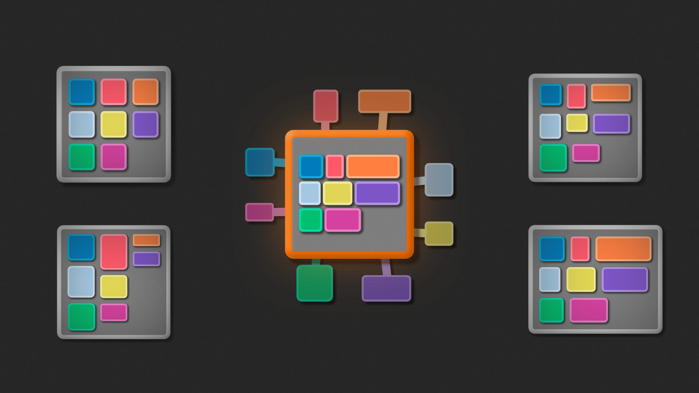
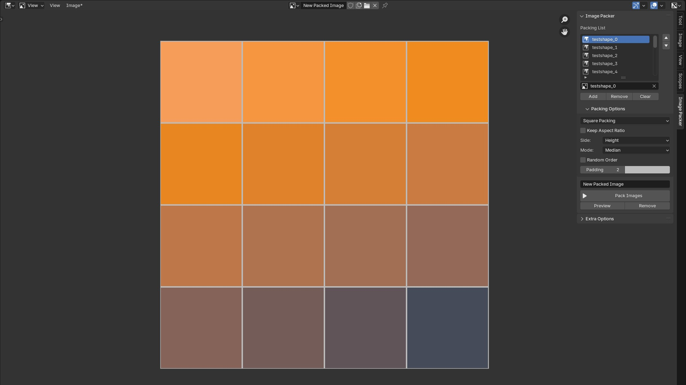
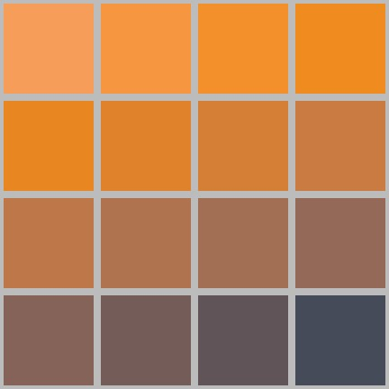

# Image Packer

This Blender addon allows you to combine multiple images into a single image using different packing algorithms. You can also add padding to each image as needed. The Image Packer panel is only visible in the Image Editor area.

  

## Packing Algorithms

This addon has the following packing methods:

### Square Packing: 

- Preserve the aspect ratio of original images or stretch them.
- Scale image based on width or height (preserve aspect ratio).
- Image size based on average/median/minimal/maximum side length or custom.
- The final image has an aspect ratio of 1x1.
    
  

### Row Packing:

- Scales all images to the same height.
- Image height based on average/median/minimal/maximum height or custom.
- The final image aspect ratio is the median ratio of all images.
  
  

### Column Packing
- Scales all images to the same width.
- Image width based on average/median/minimal/maximum width or custom.
- The final image aspect ratio is the median ratio of all images.

  

### Next Fit Packing
- Keeps the size of the images but may result in gaps between the rows.
- The final image aspect ratio is the median ratio of all images
  
  

## Extra Options
Beside the packing options you can also change:
- Randomize the order of the images.
- Add padding around the image.

  

- Change background colour.
- Delete unused images in the blend file.
- Add all images in the blend file to the packing list.

## Installation

To install this addon, do the following:

1. Download the latest release from the [releases page](https://github.com/HerrWaffel/image-packer/releases).
2. In Blender, go to Edit > Preferences > Add-ons.
3. Click the "Install" button, and select the downloaded .zip file.
4. Enable the addon by checking the checkbox next to its name.

## Usage

To use this addon, do the following:

1. Open a new Blender file.
2. Go to the Image Editor area.
3. Open the Image Packer panel and set the collection name and background colour.
4. In the Image Packer panel, select the images you want to add to the packing list.
5. Choose a packing algorithm from the dropdown menu.
6. Optionally, dail in additional options as needed.
7. Click the "Pack Images" button to generate the combined image.

## Troubleshooting

If you experience any issues with this addon, try the following:

1. Make sure you have installed the latest version of the addon.
2. Check the Blender console (Window > Toggle System Console) for any error messages.
3. If you still can't resolve the issue, open an issue on the [GitHub repository](https://github.com/HerrWaffel/image-packer/issues).

## License

This addon is released under the GNU General Public License (GPL). See [LICENSE](LICENSE) for details.
